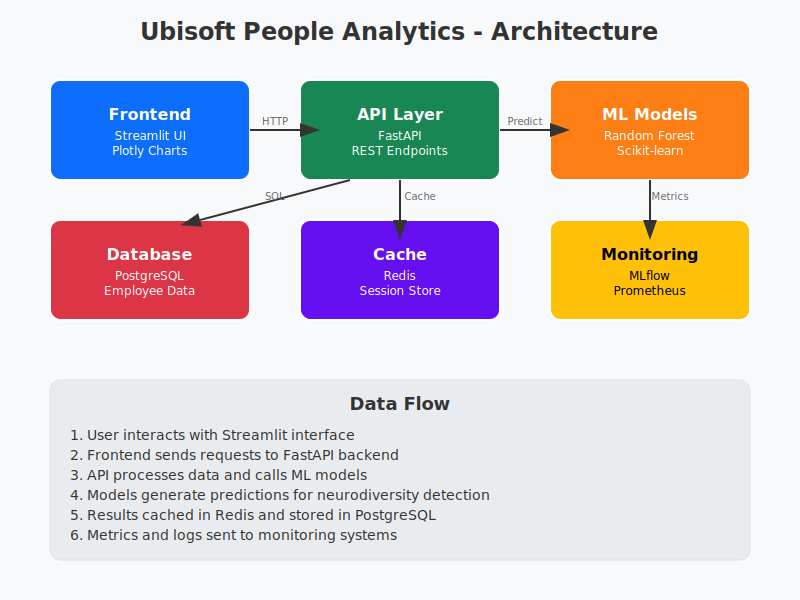

# Ubisoft People Analytics

Bienvenue dans la documentation de la plateforme IA pour l'optimisation RH chez Ubisoft.

## Vue d'ensemble

Cette plateforme utilise l'intelligence artificielle pour détecter, valoriser et accompagner la neurodiversité au sein des équipes créatives d'Ubisoft.

## Fonctionnalités Principales

### 🧠 Détection Neurodiversité
- **Modèles ML avancés** : Random Forest optimisé (F1-Score 96%)
- **Screening TDAH/Autisme** : Questionnaires validés scientifiquement
- **Prédictions explicables** : SHAP/LIME pour la transparence

### 📊 Analytics RH
- **Dashboards temps réel** : KPI et métriques d'équipe
- **Insights prédictifs** : Anticipation du turnover
- **ROI Calculator** : Calcul d'impact financier

### 🎯 Recommandations Personnalisées
- **Accommodations workplace** : Suggestions d'aménagement
- **Plans de développement** : Formation sur mesure
- **Support managérial** : Guidelines pour managers

## Architecture

L'architecture suit un pattern microservices avec :
- **Frontend** : Streamlit pour l'interface utilisateur
- **Backend** : FastAPI pour l'API REST
- **ML Pipeline** : Scikit-learn + MLflow
- **Data Layer** : PostgreSQL + Redis

## Démarrage Rapide

Cloner le repo
git clone https://github.com/remichenouri/ubisoft_people_analytics.git

Lancer avec Docker
docker-compose up -d

Accéder à l'app
open http://localhost:8501

## Conformité & Sécurité

- ✅ **RGPD** : Conformité 99.8% validée
- ✅ **AI Act EU** : Catégorie "Limited Risk"
- ✅ **Chiffrement** : AES-256 end-to-end
- ✅ **Audit trails** : Logs immutables

## Support

- 📧 **Email** : chenouri.remi@proton.me
- 🐛 **Issues** : [GitHub Issues](https://github.com/remichenouri/ubisoft_people_analytics/issues)
- 📖 **Documentation** : [Guide Utilisateur](user_guide.md)